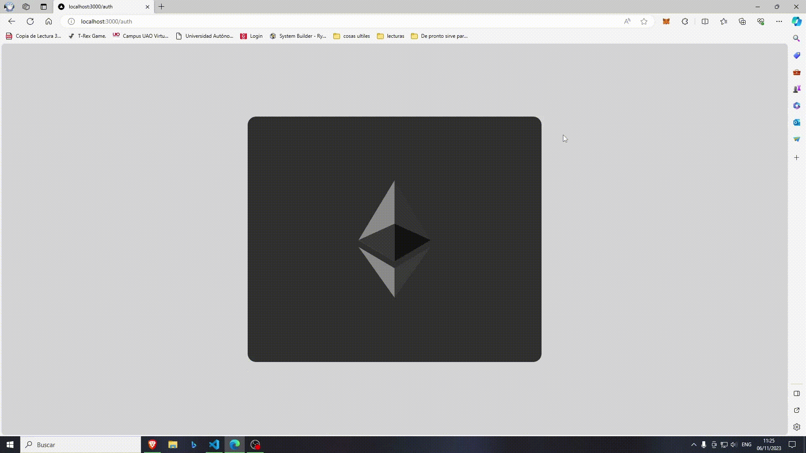

# 🌐 Blockchain Based Messaging App

---

Dada la temática de la utilización de redes de blockchain en casos de desastres naturales, el siguiente proyecto es la implementación de una demo de una aplicación web de mensajes. Esta aplicación utiliza servicios de mensajería descentralizados junto con la autenticación de Metamask.

---
## ⚒ Tecnologías Utilizadas:

- Next.js
- Sanity.io
- Gun.js

Alojado en:
- Heroku
- Vercel

---

## ⚒ Instalación:

Para una instalación rápida, solo es necesario ejecutar el cliente localmente:

1. Clonar el repositorio:
    ```
    git clone https://github.com/NEV117/blockChain-chatApp.git
    ```

2. Abrir una terminal y dirigirse a la carpeta `client`:
    ```
    cd client
    ```

3. Instalar dependencias (usando yarn):
    ```
    yarn
    ```

4. Configurar Variables de Entorno:

    Dirígete a la carpeta `client` y utiliza la estructura de `env.local.example` para crear un nuevo archivo `.env`. Pide los IDs al grupo de trabajo o utiliza unos propios.

    ```
    SANITY_PROJECT_ID='tu ID de Sanity'
    SANITY_TOKEN='tu token de Sanity'
    NEXT_PUBLIC_API_URL=http://localhost:3000/api
    ```

5. Ejecutar localmente (http://localhost:3000/):
    ```
    yarn dev
    ```

---

## 🦊 Iniciar sesión con Metamask:

Este proyecto utiliza autenticación a través de un monedero de criptomonedas (Metamask). Es necesario instalar una `extensión en el navegador` y crear una `cuenta de Metamask`.

🦊 [Metamask](https://metamask.io/download/)

    https://metamask.io/download/

<p align="center">
    
</p>

---

## ⚒ Instalación Extendida:

Para configurar por completo el proyecto, además de la configuración del cliente, se necesita hacer `deploy` de la carpeta del servidor en `Heroku` y crear una cuenta y un proyecto en `Sanity.io`.

#### Configuración de Sanity.io:

- Debes tener una cuenta en Sanity.
- Es necesario instalar la [CLI](https://www.sanity.io/docs/cli) de Sanity.
- Crear un proyecto en Sanity.

1. Abrir una terminal y dirigirse a la carpeta `studio`:
    ```
    cd studio
    ```

2. Iniciar Sanity (seleccionar opciones predefinidas):
    ```
    sanity init
    ```

3. Iniciar el estudio de Sanity (http://localhost:3333):
    ```
    sanity start
    ```

Dentro del estudio de Sanity, podemos navegar por una base de datos usada para guardar las imágenes e información de las salas de chat (NO los chats, estos están en Gun.js).

#### Configuración de Heroku:

De forma resumida, debemos hacer `deploy` de la carpeta `server` del repositorio en nuestra cuenta de Heroku. Para esto, es necesario:

- Tener una cuenta en Heroku.
- Instalar la [CLI](https://devcenter.heroku.com/articles/heroku-cli) de Heroku.
- Crear un proyecto en Heroku.
- Configurar el proyecto local con el proyecto en Heroku.

---
### 🧾 Creditos 
<p align="left">
  Este proyecto es una versión modificada y adaptada de un proyecto de  <a href="https://www.youtube.com/@CleverProgrammer">@Clever Programmer</a>
</p>
